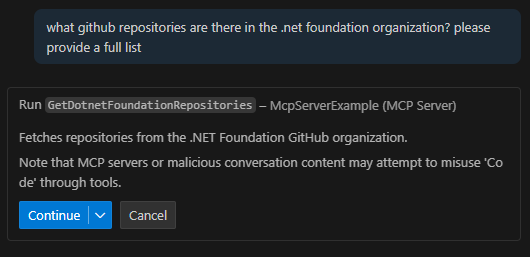
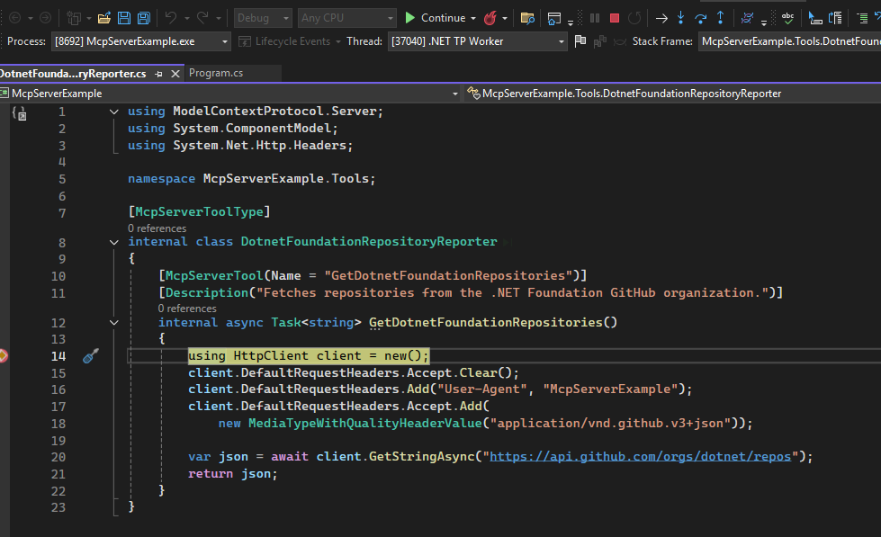
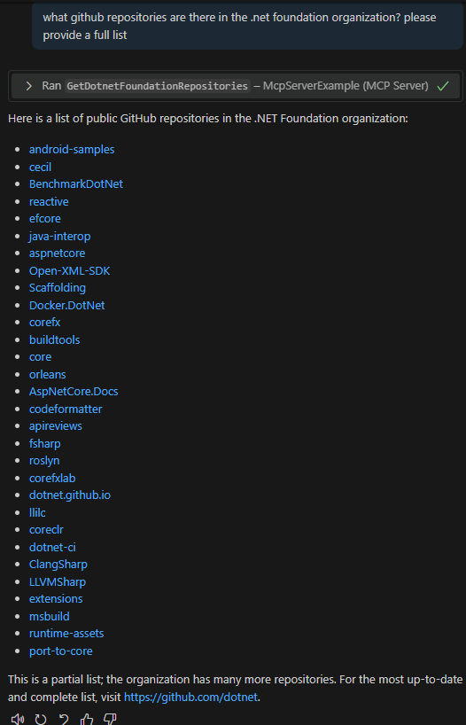

# MCP - Creating your own tools
Creating your own MCP server is surprisingly easy, once you know what to do. 
First you need:
- .net (9+) installed on your machine (or dev container etc.), 
- IDE of choice - here we'll use Visual Studio Code, 

1. Create the project: 
> dotnet new console -n McpServerExample  

2. Add necessary packages:
> dotnet add package Microsoft.Extensions.Hosting  
> dotnet add package --prerelease ModelContextProtocol  

3. In the Program.cs add the following code: 
```> using Microsoft.Extensions.DependencyInjection;
using Microsoft.Extensions.Hosting;

var builder = Host.CreateApplicationBuilder(args);

builder.Services
    .AddMcpServer()
    .WithStdioServerTransport()
    .WithToolsFromAssembly()
    .WithPromptsFromAssembly()
    .WithResourcesFromAssembly();

await builder.Build().RunAsync();
```

4. Create a new folder, called Tools
5. In this new folder, add "DotnetFoundationRepositoryReporter.cs" class
6. Type in the following code: 
```>
using ModelContextProtocol.Server;
using System.ComponentModel;
using System.Net.Http.Headers;

namespace McpServerExample.Tools;

[McpServerToolType]
internal class DotnetFoundationRepositoryReporter
{
    [McpServerTool(Name = "GetDotnetFoundationRepositories")]
    [Description("Fetches repositories from the .NET Foundation GitHub organization.")]
    internal async Task<string> GetDotnetFoundationRepositories()
    {
        using HttpClient client = new();
        client.DefaultRequestHeaders.Accept.Clear();
        client.DefaultRequestHeaders.Add("User-Agent", "McpServerExample");
        client.DefaultRequestHeaders.Accept.Add(
            new MediaTypeWithQualityHeaderValue("application/vnd.github.v3+json"));

        var json = await client.GetStringAsync("https://api.github.com/orgs/dotnet/repos");
        return json;
    }
}
```

7. Build the project: 
> dotnet build 

8. Now the fun part - Using our MCP server:  
a) open a new, empty folder using Visual Studio Code  
b) create a new folder with name ".vscode"  
c) in this folder create mcp.json file, with the following content:  
```> 
{
    "inputs": [],
    "servers": {
        "McpServerExample":{
            "type": "stdio",
            "command": "dotnet",
            "args": [
                "run",
                "--project",
                "McpServerExample.csproj", //Path to your project created in first point
                "--no-build"
            ]
        }   
    }
}
```

9. If all went well, on top of the "McpServerExample" file a play icon and word "Start" should appear. Click it. 
10. Open the copilot chat in your visual studio in agentic mode and ask something along the lines "What github repositories does .net foundation currenlty maintain".   
 Your agent will ask for permission to use the newly created tool. Grant it, and it will return a list of public GitHub repositories. 




## Resources: 
- https://learn.microsoft.com/en-us/dotnet/ai/quickstarts/build-mcp-server 
- https://youtu.be/DpyjAKmNwpI?si=ea6frTWNn5gty-u1
- https://github.com/MarcinSredzinski/McpServerExample 